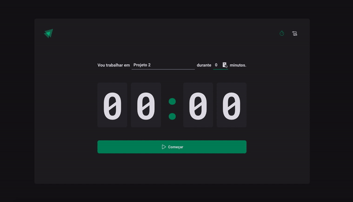

<h1 align="center">
    
</h1>


## 💻 Projeto

Desenvolvimento de um pomodoro utilizando styled-components, react-hook-form, zod, react-router-dom, context API, hooks, reducers, imutabilidade com immer, além de aplicar o TypeScript para adicionar tipagem estática.

## 🧪 Tecnologias

Este projeto foi desenvolvido com as seguintes tecnologias
- [React.js](https://pt-br.reactjs.org/)
- [JavaScript](https://developer.mozilla.org/pt-BR/docs/Web/JavaScript)
- [TypeScript](https://www.typescriptlang.org/)
- [Vite](https://vitejs.dev/)
- [Styled-Components](https://styled-components.com/)
- [Immer](https://immerjs.github.io/immer/)
- [Zod](https://zod.dev/)

## 🚀 Como instalar
### Clone este repositório.
```bash
## Ignite Timer

# Entre na pasta
$ cd ignite-timer

# Instale as dependências
$ npm install

# Execute aplicação
$ npm run dev

```
---

<p>Feito com 💜 by Lucas Barque da Silva</p>

[](https://www.linkedin.com/in/lucas-barque/)
[](mailto:lucasbarquedasilva@hotmail.com)
